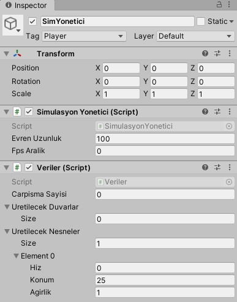

# C# ile oluşturulmuş tek boyutlu evren
TekBoyutEvren projesi bir eksendeki hareketli ve sabit nesnelerin çarpışmalarını simüle etmek amacıyla oluşturuldu. Proje C# dili kullanılarak yazıldı ve verilerin (nesnelerin konumu gibi) görselleştirilmesi için Unity3D ortamı kullanıldı. 

### Örnek
 

### Kullanım
 

Veriler componentinden üretilmesini istediğiniz nesne ve duvar miktarını girerek açılan element kısımlarına bu nesnelerin özelliklerini girebilirsiniz

#### Eksik Yanlar
- Çok yüksek hızlarda çarppışmalar çok iyi yakalanamayabiliyor
- İkiden fazla nesnenin eş zamanlı çarpışmalarında hesaplamalar yeterince doğru yapılamayabiliyor 

#### Eklenecekler
- Değiştirilebilir sürtünme kuvveti
- Nesnelere anlık olarak kuvvet uygulayabilme
- Nesnelere farklı boyut atayabilme
- Simülasyon sırasında nesne üretebilme
